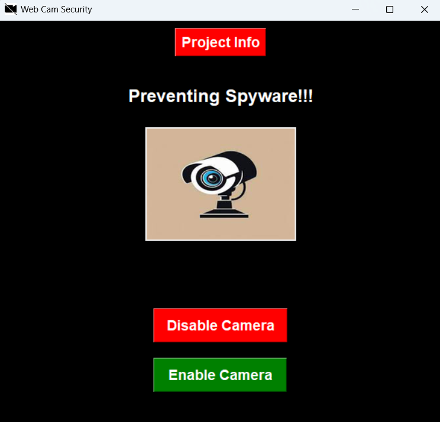

# 🛡️ Webcam Spyware Protection Tool

<div align="center">


</div>

---

## 📋 Table of Contents

- [Overview](#-overview)
- [Features](#-features)
- [Tech Stack](#-tech-stack)
- [Project Structure](#-project-structure)
- [Setup & Usage](#-setup--usage)
- [How It Works](#-how-it-works)
- [Security Highlights](#-security-highlights)
- [Future Roadmap](#-future-roadmap)
- [License](#-license)
- [Author](#-author)

---

## 🔒 Overview

**Webcam Spyware Protection Tool** is a Python-based desktop security application designed to protect users from **unauthorized webcam access (spyware attacks)**.
It combines **hardware-level control** (via Windows Registry) with a **Two-Factor Authentication (Email OTP)** system, ensuring only verified users can enable/disable the webcam.

The app is built with a **modern Tkinter GUI**, offers real-time status updates, and includes a project info portal.

---

## ✨ Features

- 🔐 **Two-Factor Authentication** – Email-based OTP before any webcam action.
- ⚡ **Hardware-Level Security** – Direct modification of Windows Registry for webcam control.
- 🖥️ **Modern GUI** – Tkinter-based, intuitive user interface.
- 📢 **Real-Time Updates** – Status messages for all operations.
- ℹ️ **Project Information Portal** – Built-in page with project & developer details.
- 📜 **Access Logging** – Tracks enable/disable attempts.

---

## 🛠️ Tech Stack

**Frontend**

- Tkinter (GUI Framework)

**Backend**

- Python 3.x
- smtplib (Email OTP system)
- Windows Registry Access (via subprocess commands)

**Libraries**

- Pillow (Image Handling)
- secure-smtplib (Secure Email)

---

## 📂 Project Structure

```plaintext
Webcam_Spyware_Protection/
├── webcam-spyware-tool.py    # Main application
├── README.md                 # Documentation
└── resources/                # App icons/images
```

---

## 🚀 Setup & Usage

### 🔧 Prerequisites

- Windows OS (Administrator privileges required)
- Python 3.x installed
- Internet connection (for OTP delivery)

### 🔽 Installation

```bash
git clone https://github.com/hemanth-devzone/Webcam-Security-Tool.git
cd Webcam-Security-Tool
pip install pillow secure-smtplib
python webcam-spyware-tool.py
```

### 📥 Download Executable

Don't want to install Python?
👉 [Download the latest release (.exe)](https://github.com/hemanth-devzone/Webcam-Security-Tool/releases)

---

## 🔄 How It Works

1. Launch the app
2. Choose action → Enable / Disable Webcam
3. Enter email → Receive OTP
4. Verify OTP → Registry modified to allow/block webcam
5. Status update → Success or error displayed

---

## 🔐 Security Highlights

- ✅ Hardware-level registry control
- ✅ Encrypted TLS/SSL email communication
- ✅ Email OTP authentication
- ✅ Exception handling & rollback
- ✅ Logs for security auditing

---

## 🖼️ Screenshots



_Main application window of the Webcam Spyware Protection Tool_

---

## 🔮 Future Roadmap

- 🔑 OAuth 2.0 for email authentication
- ⏳ OTP expiration mechanism
- 🎨 Enhanced UI/UX with modern themes
- 🖥️ Cross-platform support (Linux, macOS)
- 📌 System tray integration
- 🔄 Auto security updates

---

## 📝 License

This project is proprietary software developed during an internship at Supraja Technologies.
All rights reserved.

---

## 👨‍💻 Author

**Hemanth Kumar Reddy K**
Cybersecurity Internship @ Supraja Technologies

📧 hemanthgreat100@gmail.com
💼 [LinkedIn](https://www.linkedin.com/in/hemanth-kumar-reddy/)

---

⚠️ **Note**

This application requires Administrator privileges to modify Windows Registry.
Use with caution and always verify your webcam status after operations.

<p align="center">Made with ❤️ by Hemanth Kumar Reddy</p>
